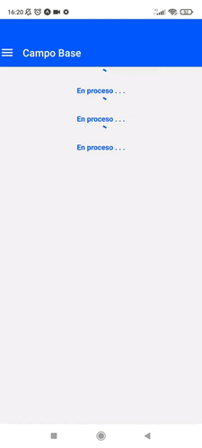

# gaztaroa-app

**Gaztaroa App** is a sample app created with [JavaScript](https://developer.mozilla.org/en-US/docs/Web/JavaScript) and [React Native](https://reactnative.dev/) JS framework for native app development.



## Description

Next, are some of the features implemented within this app:

- [React Native Components](https://reactnative.dev/docs/intro-react-native-components)
- [Navigation](https://reactnavigation.org/)
- [Buttons](https://reactnative.dev/docs/button)
- [Icons](https://reactnativeelements.com/docs/1.2.0/icon)
- App state with [Redux](https://react-redux.js.org/)
- [Redux-Thunk](https://github.com/reduxjs/redux-thunk)
- [Activity Indicators](https://reactnative.dev/docs/activityindicator)
- Forms
- Communication with server backend

## Prerequisites

- [Yarn](https://yarnpkg.com/)

## Installation

Run next command on a console:

```bash
$ make install
```

## Usage

Run backend server:

```bash
$ make serve HOST=<public_ip>
```

To start application with [Expo](https://expo.dev/) run the next command:

```bash
$ make start
```

Otherwise, build application for Android and iOS:

```bash
$ make build
```

## Docs

See Gaztaroa App [Docs](https://apabolleta.github.io/gaztaroa-app/) for more information.
